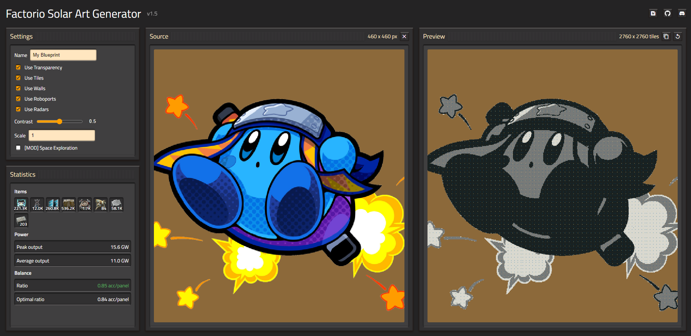

# Factorio Solar Art Generator

This is a small web application that converts pictures into blueprints for huge solar farms.

Try to keep the pictures small (up to 900x900 should be fine). The app struggles with larger images.

# Example

# Install the app for offline use

This app is a PWA (Progressive web app) which means you can install it like any other application.
The benefit of installing it is that you can use it offline.
